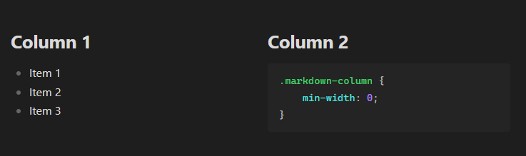

# Obsidian Columns

One of Markdown's major limitations is the inability to create columns, even though doing so would be extremely useful in some cases.
This plugin attempts to address this issue by introducing a new `columns` block.

With this plugin, you can create an unlimited number of columns that retain the original Markdown formatting, without needing to rewrite the note in HTML.

## Features

- Unlimited number of columns
- Full Markdown rendering inside each column
- Supports code blocks, callouts, tables, lists, images, and links
- No HTML required
- Responsive layout

## Usage

It's recommended to use **4** backticks instead of **3**, because this allows you to use code blocks inside columns without breaking the outer `columns` block.

Columns are separated with 3 colons: `:::`  
Each column can contain any valid Markdown content.

### Example

`````
````columns
# Column 1

- Item 1
- Item 2
- Item 3

:::
# Column 2
```css
.markdown-column {
    min-width: 0;
}
```
````
`````

Will be rendered as:



## Installation

The plugin can be downloaded from the Obsidian plugin browser.

## License

MIT License